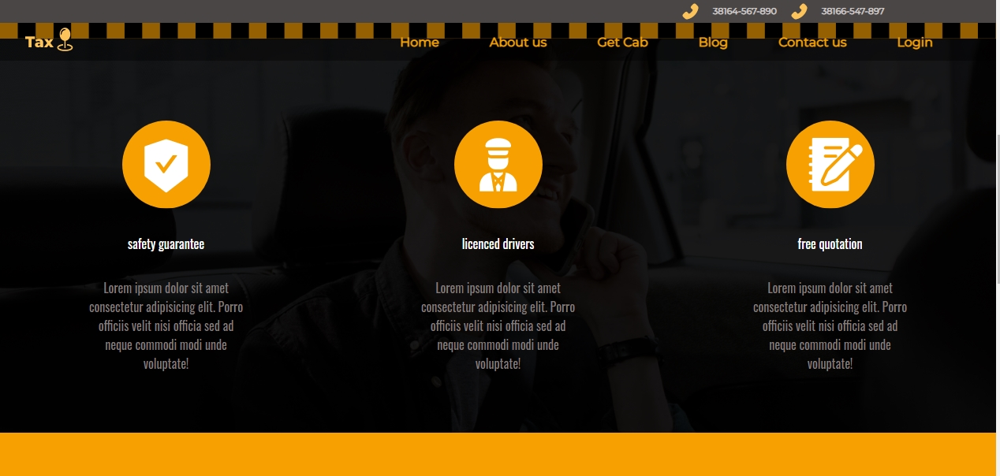
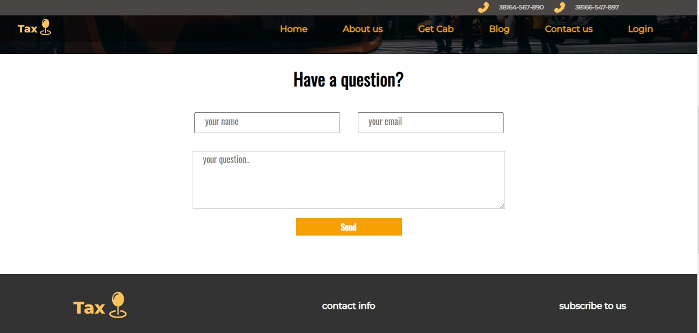
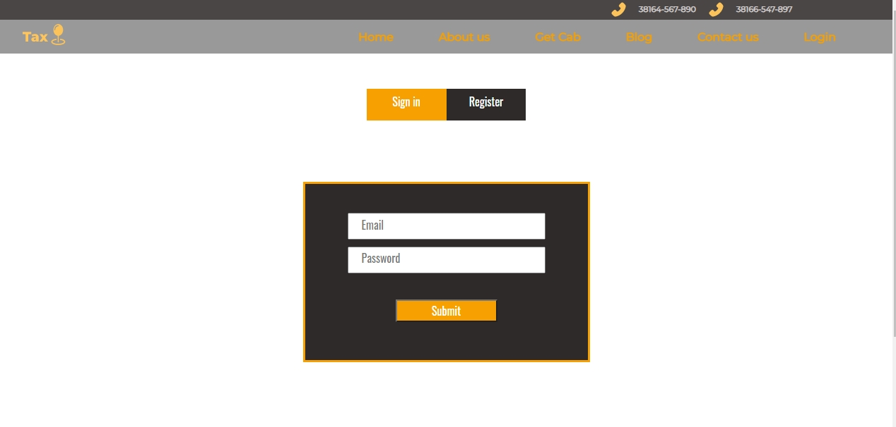

<h1>*Screenshot number 1 </h1>

<h1>*Screenshot number 2 </h1>

<h1>*Screenshot number 3 </h1>

<h1>*Screenshot number 4 </h1>

<h1>*Screenshot number 5 </h1>

<h1>*Screenshot number 6 </h1>

<h1>*Screenshot number 7 </h1>

<h1>*Screenshot number 8 </h1>

<h1>*Screenshot number 9 </h1>

<h1>*Screenshot number 10 </h1>

<h1>*Screenshot number 11 </h1>

<h1>*Screenshot number 12 </h1>

<h1>*Screenshot number 13 </h1>

